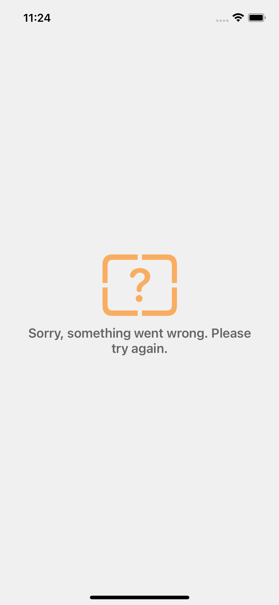
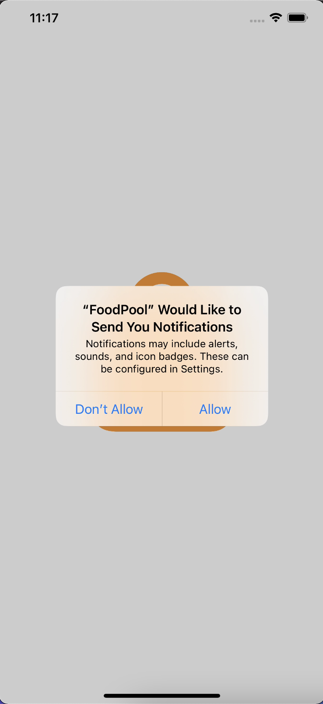
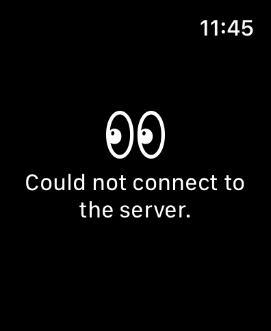

  <a href="#calling-about">About</a>&nbsp;&nbsp;&nbsp;|&nbsp;&nbsp;&nbsp;
  <a href="#gear-technologies">Technologies</a>&nbsp;&nbsp;&nbsp;|&nbsp;&nbsp;&nbsp;
  <a href="#sparkles-main-features">Features</a>&nbsp;&nbsp;&nbsp;|&nbsp;&nbsp;&nbsp;
  <a href="#camera_flash-screenshots">Screenshots</a>&nbsp;&nbsp;&nbsp;|&nbsp;&nbsp;&nbsp;
  <a href="#memo-license">License</a>&nbsp;&nbsp;&nbsp;|&nbsp;&nbsp;&nbsp

  

## :calling: About
FoodPool is an application that allows users to order food easily.

## :gear: Technologies

- [LayoutKit](https://github.com/aysenurbakirci/LayoutKit)
- [AutoLayoutHelper](https://github.com/aysenurbakirci/AutoLayoutHelper)
- [RxSwift](https://github.com/ReactiveX/RxSwift)

The project is modeled in accordance with the MVVM structure. 
Unit test coded all ViewModels of the application. 
 

## :sparkles: Main Features

- Application has onboarding page for presentation.
- Home page has listed categories and restaurants.
- Restaurant's meals and drinks are listed on the restaurant detail page.
- Users are able to see on order page, previous and current orders.
- User are able to see user's data and addresses in profile page.

## :camera_flash: Screenshots

- Phone

    

     

  
   
  

- Watch

  
   

## :memo: License 
This project is under the terms of the MIT license.
 
 
Contact: https://www.linkedin.com/in/aysenurbakircii/
